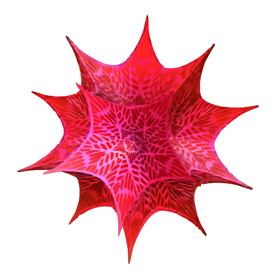
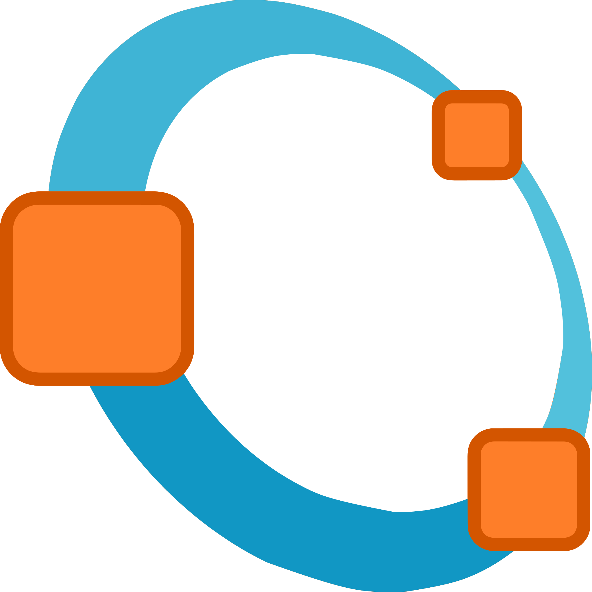
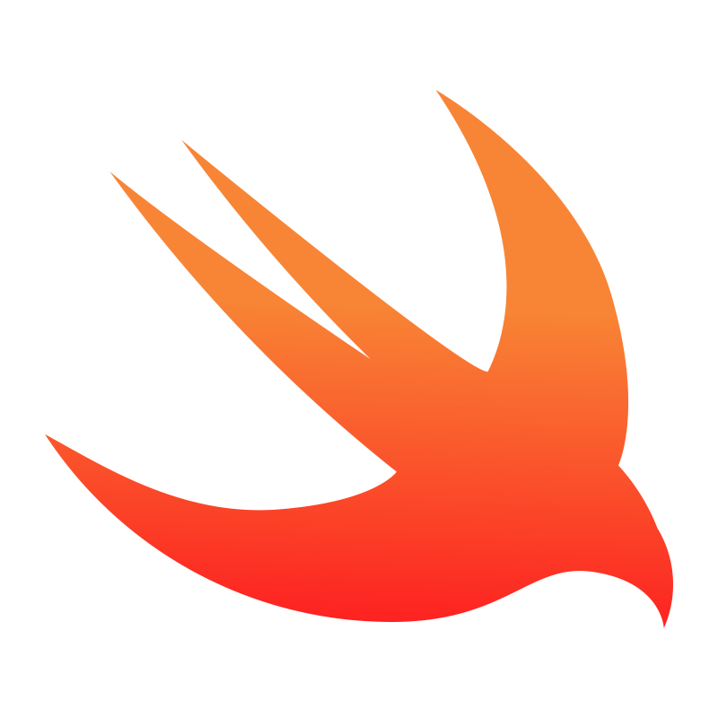

<!-- ===================================================== -->
<!-- HEADER (onda superior animada)                        -->
<!-- ===================================================== -->

  

<!-- ===================================================== -->
<!-- TÍTULO PRINCIPAL                                      -->
<!-- ===================================================== -->
<h1 align="center" style="border:none; margin:0; padding:0;">
  Academic Portfolio of Scientific and Computational Projects
</h1>

<!-- ===================================================== -->
<!-- DESCRIÇÃO DO REPOSITÓRIO                              -->
<!-- ===================================================== -->

  Repository of code, graphs, and spreadsheets developed throughout my academic journey at the Federal University of Pará, 
  with experience in programming languages C, C++, Fortran, Haskell, LISP, Prolog, ML, APL, ALGOL, and Swift, 
  using numerical libraries LAPACK, BLAS, LINPACK, and EISPACK, and tools such as X’Pert (XRD), Diffract.Suite, 
  Origin, Wolfram Mathematica, and MATLAB/Octave.

<!-- ===================================================== -->
<!-- LINHA DECORATIVA ANIMADA                              -->
<!-- ===================================================== -->

  

<!-- ESPAÇAMENTO EXTRA -->
 

<!-- ===================================================== -->
<!-- ÍCONES DE TECNOLOGIAS (STACK)                         -->
<!-- ===================================================== -->

   &nbsp;&nbsp;
   &nbsp;&nbsp;
   &nbsp;&nbsp;
   &nbsp;&nbsp;
   &nbsp;&nbsp;
   &nbsp;&nbsp;
   &nbsp;&nbsp;
   &nbsp;&nbsp;
   &nbsp;&nbsp;
   &nbsp;&nbsp;
  

<!-- ===================================================== -->
<!-- LINHA DECORATIVA INFERIOR                             -->
<!-- ===================================================== -->

  

<!-- ESPAÇAMENTO EXTRA -->
 

<!-- ===================================================== -->
<!-- ESTATÍSTICAS DO GITHUB PERSONALIZADAS                -->
<!-- ===================================================== -->

  <tr>
    <td>
      

        
    
<!-- Linguagens mais usadas -->

  

<!-- ===================================================== -->
<!-- FOOTER (onda inferior animada)                        -->
<!-- ===================================================== -->

  

